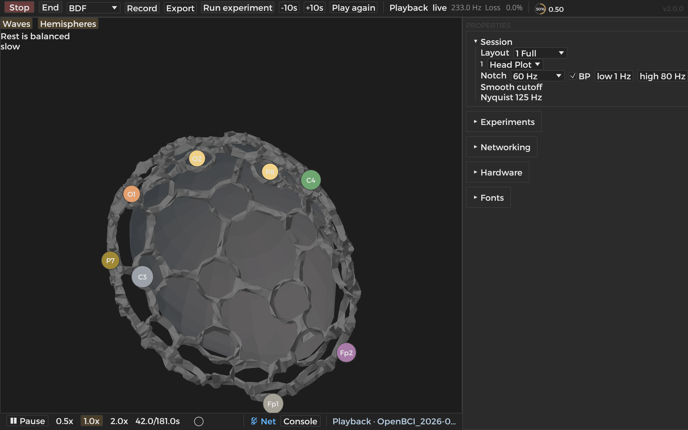

# Mind Harness

A native app for looking at EEG from an Ultracortex Mark IV. Record a sitting, play it back, and watch traces, spectra, and the headset on a head. Builds on **macOS** and **Linux**.



The Head Plot shows the Mark IV on a dummy head. The default eight inserts follow OpenBCI’s Cyton map: Fp1, Fp2, C3, C4, P7, P8, O1, O2. Empty inserts stay empty.

## Layout (portable BrainFlow)

Mind Harness depends on a **sibling** BrainFlow checkout (no machine-specific absolute paths in `Cargo.toml`):

```text
parent/
  mind-harness/
  brainflow/
    rust_package/brainflow/   # Cargo path dependency + lib/ natives
```

Example: `~/code/grok/mind-harness` beside `~/code/grok/brainflow` (symlink to `~/github/brainflow` is fine). Native libs: set `BRAINFLOW_LIB` to the directory with `libBoardController` / `DataHandler` / `MLModule` (`.dylib` on macOS, `.so` on Linux), or leave unset to use `../brainflow/rust_package/brainflow/lib`.

Compatible BrainFlow revision used on WayStation for this tree: `3a8ebea15d90ebcf162bb755afad8d45be621418` (record your own if you rebuild).

## Run (macOS)

```bash
# once: build BrainFlow natives
./scripts/build_brainflow_macos.sh
# stage dylibs into rust_package/brainflow/lib if needed (script prints steps)

cd ~/code/grok/mind-harness
cargo build --release --locked --bin mind-harness
cargo run --release --locked --bin mind-harness
```

First compile is slow; later ones are not. Optional Homebrew `lsl.framework` enables LSL on macOS only.

## Run (Linux)

Arch packages (verified on **isengard** for the **2.2.48** build path):

```bash
sudo bash scripts/install-mh-linux-deps.sh
./scripts/build_brainflow_linux.sh   # uses build-linux/; does not wipe macOS builds
cargo build --release --locked --bin mind-harness
```

Linux portability (`Cargo.toml` sibling path + OS-aware `build.rs`) lands on **2.2.53**. Full Linux rebuild of 2.2.53 is pending unless run on a Linux host. Linux LSL is not enabled by this work. Physical EEG / full UI on Linux were not re-verified for this integration.

## What it talks to

- A synthetic board, for layout without hardware
- A Cyton over a USB serial dongle
- Playback of a recording from this app or the original OpenBCI GUI

Session holds layout, notch, and band. Record sits on the transport bar. Experiments is a guided-recording card, not a second home screen.

## License

MIT. See `LICENSE`. This is original work, inspired by the OpenBCI GUI (also MIT, 2018 OpenBCI). That notice is in `NOTICE`. Not affiliated with OpenBCI.
